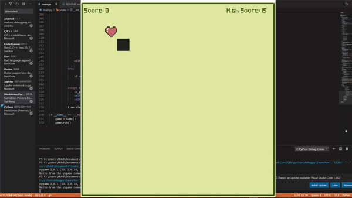
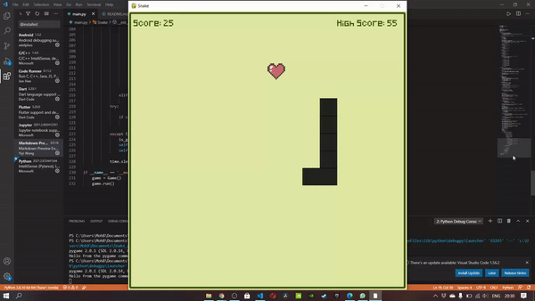
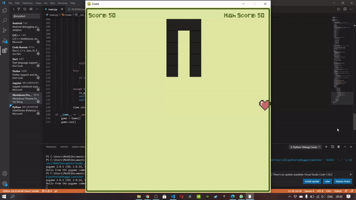
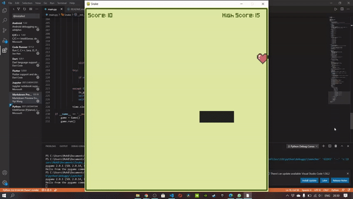
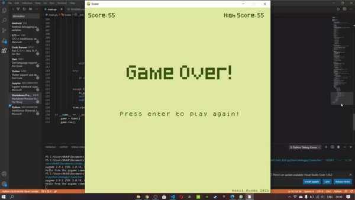

# Retro Snake Game
This is my attempt at making the iconic Snake game, which first appeared in 1997 on the Nokia 6110. The game was built in **Python** with  **PyGame**, and was designed to have a 'retro' feel to it. 
 It features the following **functionality**: 

* **Collision Detection**
* **Spawning snacks** at random location of the game window
* **Increasing length** of Snake upon eating snack
* **File handling** to maintain and update the **High Score**
* Ability to play **Sound Effects** based on the events occurring in the game

## Requirements
* **Python version >= 3.0**
* **PyGame**

## How do I run the game?
The game can be played by simply **running the main.py file** on any code editor that supports Python, provided that a version of PyGame is installed.

## Instructions to play the game
The Snake can be **moved by using the respective 'WASD'** or **Arrow keys**.
The goal of the game is to eat as many hearts as possible without bumping into the boundary walls or the body of the snake itself. The more hearts the snake eats, the greater it's length and score. If the current score is greater than the High Score, the High Score gets updated to display the current score.

Upon encountering the game over screen, the game can be **replayed by pressing the 'Enter' key**, or can be **exited by using the 'Escape' Key**.

## Screenshots
#### Snake growing in Length

#### Colliding into a Wall

#### Colliding with itself

#### Updating Score and High Score

#### Game Over

